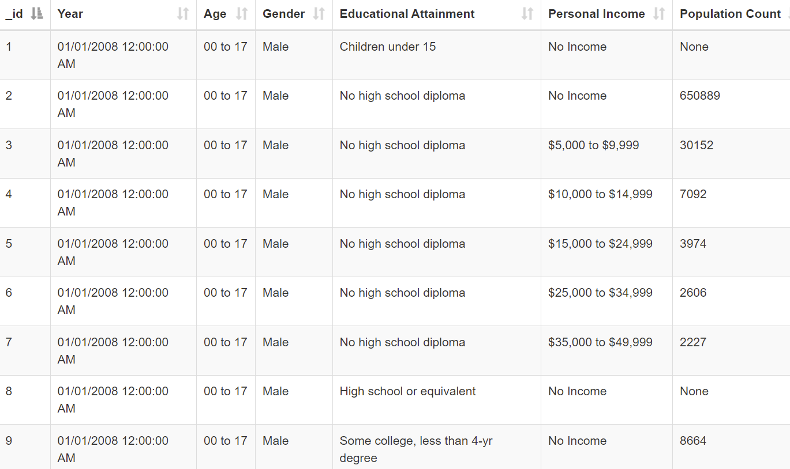

# Data sources

We got out data from California's open data portal: 
<https://data.ca.gov/dataset/ca-educational-attainment-personal-income/resource/26201f19-4469-4311-a819-bbbd3e557eda>.

Each row contains Year, Age, Gender, Educational Attainment, Personal income, and the number of people with the characteristics specified in the row.

